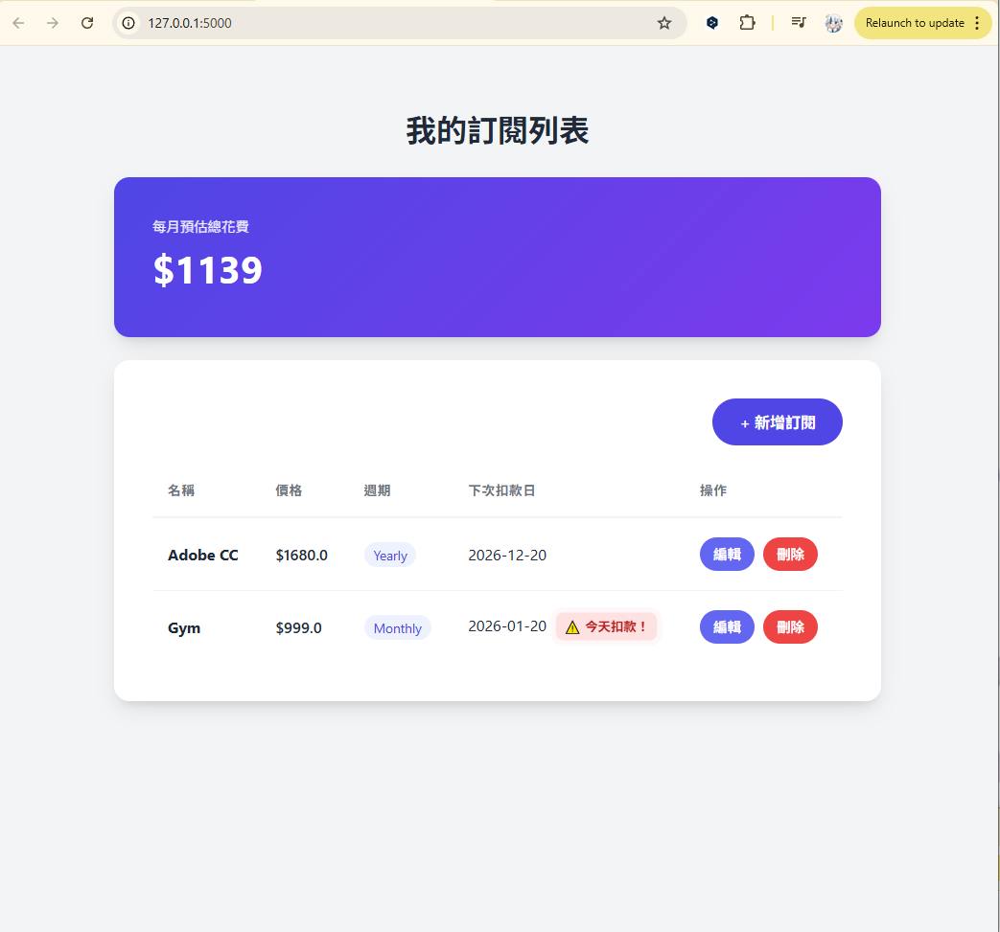
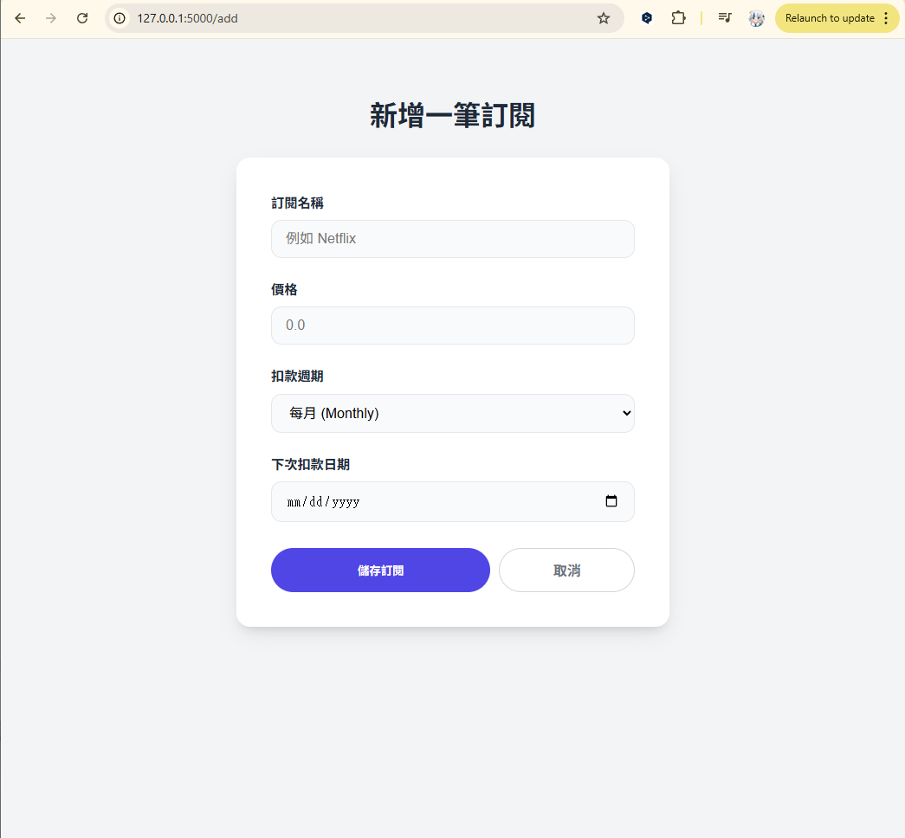

# Subscription Manager 訂閱管理系統

這是一個使用 **Python Flask** 開發的全端網頁應用程式，旨在幫助使用者追蹤管理日常的訂閱服務（如 Netflix, Spotify, 健身房會員 等）。

系統能自動計算每月預估總花費，並針對即將扣款的項目顯示醒目提示，解決訂閱項目過多導致忘記取消或預算超支的問題。

🔗 **線上 Demo**: (https://subminder-5btg.onrender.com)
*(注意：本專案部署於 Render 免費版主機，首次載入可能需要約 30-50 秒喚醒，請耐心等候。)*

## 功能特色 (Features)

* **儀表板總覽**：自動計算並顯示每月的訂閱總金額，財務狀況一目了然。
* **到期日警示**：
    * 針對 **3 天內** 即將扣款的項目，顯示紅色醒目提示與呼吸燈特效。
    * 即時計算距離下次扣款的剩餘天數。
* **完整的 CRUD 功能**：支援新增、查看、編輯與刪除訂閱項目。
* **自動化範例資料**：系統啟動時若偵測到資料庫為空，會自動寫入預設範例資料，方便展示與測試。
* **響應式介面 (Mobile-Friendly)**：採用卡片式設計 (Card Layout)，在手機與電腦上皆能流暢操作。

## 技術堆疊 (Tech Stack)

* **Backend**: Python 3, Flask
* **Database**: SQLite (Local), SQLAlchemy ORM
* **Frontend**: HTML5, CSS3 (Modern Minimalist Design), Jinja2 Templates
* **Deployment**: Render (Cloud Platform), Gunicorn

## 專案截圖 (Screenshots)

### 1. 首頁儀表板 (Dashboard)

*清楚顯示總金額與即將到期的紅色警示。*

### 2. 新增與編輯 (Add/Edit)

*簡潔的表單設計，包含日期選擇器與下拉式選單。*

## 如何在本地端執行 (Local Installation)

如果你想在自己的電腦上執行此專案，請按照以下步驟：

1. **Clone 專案**
   ```bash
   git clone [https://github.com/](https://github.com/)[你的GitHub帳號]/subscription-app.git
   cd subscription-app

2. **建立虛擬環境**
    # Windows
    python -m venv venv
    venv\Scripts\activate

    # Mac/Linux
    python3 -m venv venv
    source venv/bin/activate

3. **安裝依賴套件**
    pip install -r requirements.txt

4. **執行程式**
    python app.py

5. 開啟瀏覽器前往 http://127.0.0.1:5000 即可使用

### 專案結構
    SubMinder/
    ├── app.py              # 主要後端邏輯 (Controller) & 資料庫模型 (Model)
    ├── requirements.txt    # 專案依賴套件清單
    ├── static/             # 靜態檔案 (CSS)
    │   └── style.css
    ├── templates/          # 前端頁面 (View)
    │   ├── index.html
    │   ├── add.html
    │   └── edit.html
    └── README.md           # 專案說明文件

Designed & Developed by Bobo